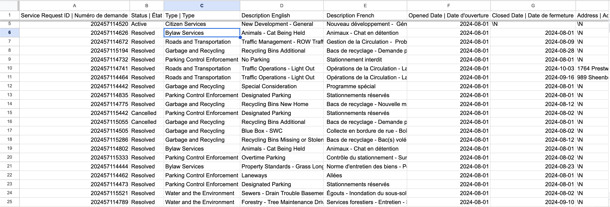
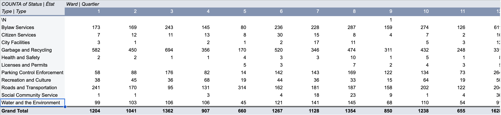
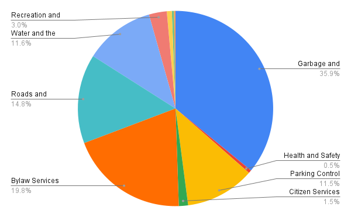

**November 4, 2024** 
**MPAD2003A Introductory Data Storytelling** 
**Andrew Stewart** 
**Presented to Jean-Sébastien Marier** 

# Midterm Project: Exploratory Data Analysis (EDA)

## 1. Introduction

In this assignment, I have been given a subset of a City of Ottawa dataset that provides a summary of requests for service that require action by City staff. Data is presented by ward and shows the responsible City department and service request description. This data was collected by the City of Ottawa and they received requests for service through email, walk in, web, and dispatch. A link to the original dataset can be found [here](https://open.ottawa.ca/documents/65fe42e2502d442b8a774fd3d954cac5/about) if you wish to find the unaltered data. A link to the altered dataset we will be using can be found [here](https://raw.githubusercontent.com/jsmarier/course-datasets/refs/heads/main/ottawa-311-service-requests-august-2024.csv) for those who wish to find it. 

## 2. Getting Data

At this point, the google sheet contains 11 columns and 28,539 rows. The data also appears to be quite messy as many columns have data that are cut off because of boxes that are too small and they remain largely un-arranged by any specific order outside of the named columns. More specifically, the dataset uses continuous variables in the H and I columns as these columns are used to track coordinates and according to section 4.2 of Statistics: Power from data! “A variable is said to be continuous if it can assume an infinite number of real values within a given interval” which is true of coordinates. The dataset also deals with numeric variables in columns E and F as these columns deal with dates which have “a quantifiable characteristic whose values are numbers” (4.2 of Statistics: Power from data!). A Third data type that can be found in the dataset is nominal variables in column B and K which “describes a name, label or category without natural order”(4.2 of Statistics: Power from data!). One thing that is surprising is that some of the service requests that came in, such as the one in row 2, do not appear to have any ward attached to them. One question that comes to mind when looking at this raw data is who exactly is responsible for the service requests which have no assigned ward to them? And further than this, how were these requests received without a ward to do so?

## 3. Understanding Data

### 3.1. VIMO Analysis

When looking at the types of requests for each specific ward, I used a pivot table with type for row, ward for column, and status for values to conduct a Vimo analysis. When conducting the Vimo analysis for this pivot table, I found that about 94.5% of the data was valid, as in “not blank or missing” and falling “within a valid range” as it was defined in Data Accuracy and Validation: Methods to ensure the quality of data(Data Accuracy and Validation: Methods to ensure the quality of data, 1:20). There were two instances of invalid data where there was no type for the request made. There were 1549 instances of missing values where there was no ward assigned to the request, making up for approximately 5.4% of the data. There was also an outlier in the values with missing wards for Water and the environment as they had a value over 4 times larger than any other ward for this type of request. 

### 3.2. Cleaning Data

I first added whitespace so that information was more easily visible on the sheet by double clicking lines between each column. 

I then froze the first row on the google sheet so that it is always visible even when scrolling by selecting the row and then clicking view, freeze, 1 row. 

After this, I used the split function to split the description of requests into English and French. I started by adding two empty columns to the right of the description column, then called the split function to split the first row of values into the new columns, then I dragged the box down so that the rest of the description column could be split into the new columns. After this, I copied the new values and pasted as values only before deleting the original description column. 

The split function I used was `=SPLIT(D1, “|”)`

The spreadsheet should now look as it does below
 

### 3.3. Exploratory Data Analysis (EDA)

I chose to use the types of requests and wards as the primary variables in the construction of my chart and pivot table because in the earlier step when I was getting the data I noticed that some service requests did not have a specific ward attached to them so I thought I should look into which requests were most being placed in this category. What I found through the pivot table was that a majority of water and the environment requests were not assigned to any specific ward with over four times the requests as compared to any of the other wards in this category. I also found that these requests without wards placed within the top three wards when it came to the number of overall requests received with over half of its value coming from the water and environment requests. I found through the chart that I made that these water and environment requests only made up 11.6% of the total requests coming in, as well as the values of the other requests. 
From these discoveries, I have learned that over half of the requests without an attached ward – which is in itself one of the top three wards receiving requests – come from a type of request making up only 11.6% of the total requests. The fact that so many of these wardless requests are linked to one of the less prevalent request types stands out and could act to suggest a potential story such as why so many requests made for water and environment are being handled without wards. These stats would warrant further investigation as to the reason behind them and I would go about investigating this by contacting some of the councilors responsible for the wards responsible for these service requests and inquiring into what happens to the requests that are not assigned to any particular ward and why so many of these requests are made about water and the environment in particular. 

To create the pivot table I clicked on insert, pivot table, and then filled in type for rows, ward for columns, and status for values. After doing so, the pivot table looks like this.
 

To create the chart I clicked insert, chart, and then set the values of chart type to pie  chart, datarange to the entire dataset, label to type and aggregated the values, and value to service request ID.after doing so, the chart should look like this.
 

## 4. Potential Story

As mentioned before, A potential story that could come out of this dataset is why so many requests made for water and environment are being handled without the allocation of wards. What would be needed beyond this dataset to tell this story would be more context as to how requests without wards are handled and why water and environment requests are mainly being handled as such. In order to acquire this information, I would interview counselors responsible for these wards such as Matthew Luloff or Cathy Curry who might know more about how requests are handled within and without the wards. One relevant source that could help provide more context into how the wards work in Ottawa is the CTV article This Ottawa ward has the most complaints about rats so far in 2024. In this article, it states how many complaints pertaining to rats were made in each ward such as “There were 83 complaints about rats in the ward [Rideau-Vanier] in 2023” which suggests that when complaints are made in Ottawa they are separated into different geographical wards to keep track of (Pringle 2024). Another source that could be used to provide context would be the Ottawa Ward Boundary Review by bayward bulletin which has a pdf map of the different ward boundaries(Bayward Bulletin). 

## 5. Conclusion

One thing that I found most challenging while completing this assignment was dealing with the chart tool in google sheets. I struggled to remember how to bring down the amount of labels in my chart and it took a while to realize I could just use the aggregate box to do so. In terms of the most rewarding aspect, I found splitting the description column into two language separated columns with the split function to be the most satisfying because it made the dataset look much more clean than having one very long column. When considering gaps in my knowledge uncovered during the process of this midterm assignment, I am not as comfortable with the graphing tools at my disposal than I had originally believed and should touch up on my knowledge of markdown since I had to spend a lot of time trying to figure it out while working on this. One thing I could have done differently is to try and use different data cleaning tools. I decided to freeze a row, add white spaces, and split a column but there were other options available to me such as data cleaning tools like find and replace and duplicates. 

## 6. References

Statistics Canada. Sept 2, 2021. Statistics: Power from Data!. https://www150.statcan.gc.ca/n1/edu/power-pouvoir/toc-tdm/5214718-eng.htm

Statistics Canada. Sept 23, 2020. Data Accuracy and Validation: Methods to ensure the quality of data. https://www.statcan.gc.ca/en/wtc/data-literacy/catalogue/892000062020008

Pringle, Josh. May 9, 2024. This Ottawa ward has the most complaints about rats so far in 2024. CTV News. https://ottawa.ctvnews.ca/this-ottawa-ward-has-the-most-complaints-about-rats-so-far-in-2024-1.6879854

Bayward Bulletin. Dec 11, 2020. Ottawa Ward Boundary Review. https://www.baywardbulletin.ca/ottawa-ward-boundary-review-project/