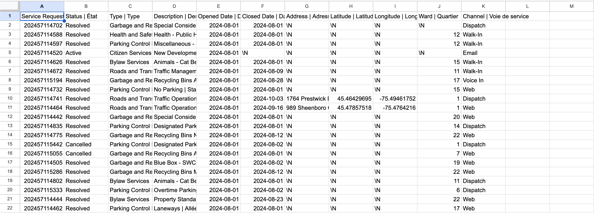

**November 4, 2024**<br>
**MPAD2003A Introductory Data Storytelling**<br>
**Andrew Stewart**<br>
**Presented to Jean-Sébastien Marier**<br>

# Midterm Project: Exploratory Data Analysis (EDA)

Use one hashtag symbol (`#`) to create a level 1 heading like this one.

## Foreword

For this assignment, you must extract data from a dataset provided by the instructor. You must then clean and analyze the data, create exploratory charts/visualizations, and find a potential story idea. Your assignment must clearly detail your process. You are expected to write about 1500-2000 words, and to include several screen captures showing the different steps you went through. Your assignment must be written with the Markdown format and submitted on GitHub Classroom.

I have been assigning different versions of this project to my digital journalism and data storytelling students for a few years now. Its structure was inspired by the main sections/chapters of [*The Data Journalism Handbook*](https://datajournalism.com/read/handbook/one/). This version was further inspired by the [Key Capabilities in Data Science](https://extendedlearning.ubc.ca/programs/key-capabilities-data-science) program offered by the University of British Columbia (UBC).

**Here are some useful resources for this assignment:**

* [GitHub's *Basic writing and formatting syntax* page](https://docs.github.com/en/get-started/writing-on-github/getting-started-with-writing-and-formatting-on-github/basic-writing-and-formatting-syntax)
* [The template repository for this assignment in case you delete something by mistake](https://github.com/jsmarier/jou4100_jou4500_mpad2003_project2_template)

Did you notice how to create a hyperlink? In Markdown, we put the clickable text between square brackets and the actual URL between parentheses.

And to create an unordered list, we simply put a star (`*`) before each item.

## 1. Introduction

In this assignment, I have been given a subset of a City of Ottawa dataset that provides a summary of requests for service that require action by City staff. Data is presented by ward and shows the responsible City department and service request description. This data was collected by the City of Ottawa and they received requests for service through email, walk in, web, and dispatch. A link to the original dataset can be found [here](https://open.ottawa.ca/documents/65fe42e2502d442b8a774fd3d954cac5/about) if you wish to find the unaltered data. A link to the altered dataset we will be using can be found [here](https://raw.githubusercontent.com/jsmarier/course-datasets/refs/heads/main/ottawa-311-service-requests-august-2024.csv) for those who wish to find it. 

## 2. Getting Data

Use two hashtag symbols (`##`) to create a level 2 heading like this one.

To include a screen capture, use the sample code below. Your images should be saved in the same folder as your `.md` file.

<br>
*Figure 1: The "Import file" prompt on Google Sheets.*

**Here are examples of functions and lines of code put in grey boxes:**

1. If you name a function, put it between "angled" quotation marks like this: `IMPORTHTML`.
1. If you want to include the entire line of code, do the same thing, albeit with your entire code: `=IMPORTHTML("https://en.wikipedia.org/wiki/China"; "table", 5)`.
1. Alternatively, you can put your code in an independent box using the template below:

``` r
=IMPORTHTML("https://en.wikipedia.org/wiki/China"; "table", 5)
```
This also shows how to create an ordered list. Simply put `1.` before each item.

Because we are dealing with such a large dataset, I downloaded the dataset as a pdf and then imported it into google sheets using file import. After importing the dataset, You should be left with a google sheet that looks like this: 
<br>

If you wish to take a look at my google sheet, a link can be found [here](https://docs.google.com/spreadsheets/d/1YBwdG1jH9G5g3GpXgDVMFjAQqHQR6V4IGBSvAFVN5Mg/edit?usp=sharing). 

At this point, the google sheet contains 11 columns and 28,539 rows. The data also appears to be quite messy as many columns have data that are cut off because of boxes that are too small and they remain largely un-arranged by any specific order outside of the named columns. More specifically, the dataset uses continuous variables in the H and I columns as these columns are used to track coordinates and according to section 4.2 of Statistics: Power from data! “A variable is said to be continuous if it can assume an infinite number of real values within a given interval” which is true of coordinates. The dataset also deals with numeric variables in columns E and F as these columns deal with dates which have “a quantifiable characteristic whose values are numbers” (4.2 of Statistics: Power from data!). A Third data type that can be found in the dataset is nominal variables in column B and K which “describes a name, label or category without natural order”(4.2 of Statistics: Power from data!). One thing that is surprising is that some of the service requests that came in, such as the one in row 2, do not appear to have any ward attached to them. One question that comes to mind when looking at this raw data is who exactly is responsible for the service requests which have no assigned ward to them? And further than this, how were these requests received without a ward to do so?


## 3. Understanding Data

### 3.1. VIMO Analysis

Use three hashtag symbols (`###`) to create a level 3 heading like this one. Please follow this template when it comes to level 1 and level 2 headings. However, you can use level 3 headings as you see fit.

Insert text here.

Support your claims by citing relevant sources. Please follow [APA guidelines for in-text citations](https://apastyle.apa.org/style-grammar-guidelines/citations).

**For example:**

As Cairo (2016) argues, a data visualization should be truthful...

### 3.2. Cleaning Data

Insert text here.

### 3.3. Exploratory Data Analysis (EDA)

Insert text here.

**This section should include a screen capture of your pivot table, like so:**

<br>
*Figure 2: This pivot table shows...*

**This section should also include a screen capture of your exploratory chart, like so:**

<br>
*Figure 3: This exploratory chart shows...*

## 4. Potential Story

Insert text here.

## 5. Conclusion

Insert text here.

## 6. References

Include a list of your references here. Please follow [APA guidelines for references](https://apastyle.apa.org/style-grammar-guidelines/references). Hanging paragraphs aren't required though.

**Here's an example:**

Bounegru, L., & Gray, J. (Eds.). (2021). *The Data Journalism Handbook 2: Towards A Critical Data Practice*. Amsterdam University Press. [https://ocul-crl.primo.exlibrisgroup.com/permalink/01OCUL_CRL/hgdufh/alma991022890087305153](https://ocul-crl.primo.exlibrisgroup.com/permalink/01OCUL_CRL/hgdufh/alma991022890087305153)
